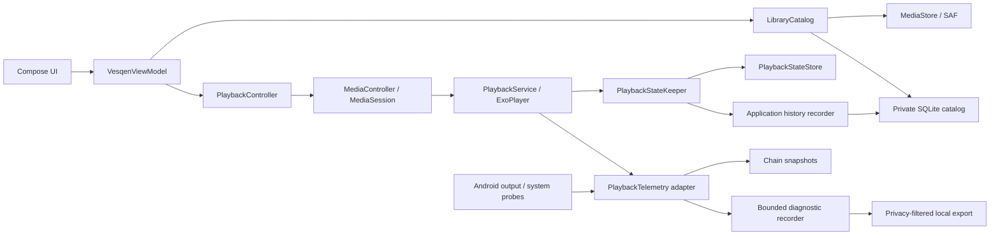

# Vesqen 架构审查 · 2026-09-05（2026-09-16 发版候选复审）

## 结论与审查边界

保留当前 Media3 播放基础，在现有包边界内收紧状态、持久化和生命周期管理。当前没有足够证据支持重写播放内核、引入全套 Clean Architecture、迁移 Room 或立即拆成多个 Gradle module。

Vesqen 的产品本体是轻量、离线优先的 Android 本地音乐播放器：普通用户先完成听歌，高级用户按需核查 source / decoder / processing / observable output 的证据。USB bit-perfect 是受能力与验证约束的目标；AI、自研内核、旧系统 USB 引擎是条件性扩展。

本次审查以 `feature/m2-audio-proof` 开始时的工作区为基线，保留已有 M1/M2 未提交修改。阅读了产品、设计、PRD、路线图、构建配置及各包的职责与关键调用链，重点追踪曲库读取、播放命令、队列恢复、服务生命周期、遥测采样和诊断导出。不是逐行穷尽审计，也不是设备验收。使用 `grill-me` / `grilling` 的逐项设计质询方式；按本次要求，将代码无法决定的产品问题留在文末，没有将建议当作已经批准的决定。

## 2026-09-16 发版候选复审增量

本次在当前 `master` 候选上复查播放安全边界、MediaStore/SAF 数据保留、数据库访问、Compose 重组身份、控制器断连和发布门禁。没有引入新框架或重写现有分层；修复集中在已经存在的所有权边界内。

| 范围 | 发现 | 处理 |
| --- | --- | --- |
| 严格 USB 输出 | 仅把 AudioTrack 音量设为 0 不能证明 PCM 没有进入错误链路；暂停、duck、路由丢失和控制器断连还存在短暂沿用 ACTIVE 的竞态。 | 在 `AudioOutput.write` 前增加同步门，只有 AudioTrack 格式、mixer readback、实际 route 和中性处理全部复核后才开放；暂停/非中性音量立即关门，路由丢失 fail closed。输出模式能力来自 MediaSession 实际命令集合；快照禁止“不连接但可发命令”的状态。 |
| MediaStore 多卷与升级 | Android 10+ 的 `external` 是合并视图；把跨卷 `_ID` 当全局身份会碰撞，扫描期间卷/generation 变化还可能错误清理。 | 每个具体卷拥有卷作用域 remote ID；升级时只迁移可唯一归属的旧行并保留稳定 catalog ID。歧义旧行隔离保留，不挂到任一新歌；只有完整且卷集合/version/generation 未变的扫描可清理本轮实际扫描卷。未挂载卷的行、收藏、历史和歌单关系保留但不展示。 |
| SAF 完整性 | provider 可通过 `EXTRA_ERROR` 返回失败 cursor；只检查 `EXTRA_LOADING` 会把失败结果当完整目录并授权清理。 | loading 或 error 任一存在都按不完整扫描处理，不清理未见行。 |
| 播放历史与列表卡顿 | 每次记播成功都会整库读取、重建播放列表投影并同步队列；Now 的动画身份又包含收藏/次数等可变字段。 | SQLite 写入原子返回单曲最终历史值，UI 只替换对应行，并以 overlay 防止较早的并发快照回滚；播放列表读取由 1+N 查询改为固定两次；Now 动画只跟随曲目/封面身份。 |
| 断连交互与证据视觉 | 部分队列命令在 Controller 未连接时静默 no-op；状态 chip 主要依赖颜色，Now 的中性色还能覆盖证据色。 | 队列编辑和“下一首/加入队列”在断连时禁用并解释原因；AVAILABLE/REQUESTED/ACTIVE/VERIFIED/FAILED 使用不同图形线索和受保护的语义色。 |
| 缓存失败边界 | 冷启动缓存读取异常可中止后续 provider 刷新；过宽兜底又会隐藏取消。 | 只在 UI 恢复入口捕获缓存异常，协程取消继续抛出，冷启动仍执行完整刷新；目录 mutation 的失败语义不变。 |

复审后仍不建议为发版前“整洁”而迁移 Room、引入完整 Clean Architecture 或抽象第二套播放引擎。当前有两个明确但不宜在本候选扩大修改面的架构债务：

- 队列检查点由服务写入，但进程死亡后的恢复仍由 UI/Controller 在取得曲库后协调；当前保证重新打开应用后的暂停恢复，不保证仅靠耳机键或系统 MediaSession resumption 恢复。若首版要承诺后一场景，应在服务侧实现 Media3 playback resumption，并先明确不得自动发声的用户意图规则。
- 大曲库刷新仍持有 catalog operation gate 遍历 provider 和元数据。播放历史整库重载与 playlist 1+N 已移除，但 1k/10k 曲库及慢 SAF provider 的 mutation 等待仍需量化后再决定是否拆分扫描事务或引入分页。

## 当前职责与数据流



| 边界 | 判断 | 原因 |
| --- | --- | --- |
| `PlaybackService` / `PlaybackController` | 合理 | 服务拥有播放器，UI 通过 MediaSession 控制；页面退出不应释放后台播放。 |
| `PlaybackStateKeeper` / history recorder | 合理 | 队列检查点和播放历史不依赖某个 Compose 页面；进度检查点复用队列投影。 |
| `LibraryCatalog` / provider adapters / SQLite | 基本合理，有规模限制 | 将授权、来源身份和扫描完成后的清理放在同一边界；当前锁覆盖完整扫描，读写交互会排队。 |
| `PlaybackTelemetry.observe()` | 应保留 | 已有明确消费者接口、按需采样、可信度与时间来源；M3 应继续供给此接口。 |
| 诊断录制 / 导出 | 合理 | 应用级录制独立于页面，数量有上限，导出通过显式用户操作并过滤隐私数据。 |
| 一个 `app` Gradle module | 当前可接受 | 尚只有一套生产播放器；现在抽出抽象引擎会增加适配和测试成本，不能自动解决已有状态问题。 |

## 已修复的问题

| 优先级 | 触发与根因 | 本次修改与验证 |
| --- | --- | --- |
| P1 | 队列 `[A, B, A]` 正在播放第二个 A，重启后恢复到第一个 A。存储仅有 `currentTrackId`，恢复使用第一次 ID 匹配。 | 新增可选 `current_queue_index`，检查点记录具体出现位置，恢复时重映射被移除曲目前后的索引。兼容没有新字段的旧记录。先复现两个失败用例，再通过重复项、缺失项、旧格式与错误索引回归。 |
| P2 | 缓冲或暂时被音频焦点抑制时 `isPlaying == false`，播放按钮再次发送 `play()`，用户无法取消待播放意图；idle 状态也缺少 `prepare()`。 | 根据 `playWhenReady` 与播放状态统一决定 Pause / Play / Prepare / Replay；mini-player 与 Now 使用同一动作投影，实际播放指标仍使用 `isPlaying`。补充状态策略和 UI 语义回归。 |
| P2 | MediaStore 数据库重建，generation 恰好与旧值相等；或者不同存储卷的内容/挂载状态变化。原缓存只存一个 generation。 | 缓存校验包含每个实际挂载卷的名称、数据库 version、generation，以及应用元数据 revision。旧校验串自然失效，触发重新扫描；无需删除数据库或用户播放列表。覆盖数据库重建、存储卷变化和枚举顺序。 |
| P2 | 曲库 IO 返回晚于权限变化或更新的缓存读取，旧结果重新覆盖 UI 并同步进播放控制层。扫描已有 epoch 校验，缓存读取缺少对应保护。 | 增加小型 `LibrarySnapshotReader`，丢弃被新读取、权限同步或新扫描作废的结果。用可控挂起的并发读取测试验证旧结果不再发布。 |
| P2 | Now 仍在 Composition 中、Activity 已进入后台时，500 ms 进度定时器仍可能继续访问 MediaController。 | 按 Chain 的现有模式绑定 `repeatOnLifecycle(STARTED)`；返回前台立即刷新。新增前后台仪器回归，编译与设备执行的证据分开记录。 |

`isPlaying` 与播放意图不同，以及 generation 必须结合数据库 version 比较，均核对了 Android 官方契约：[Media3 Player](https://developer.android.com/reference/androidx/media3/common/Player)、[MediaStore](https://developer.android.com/reference/android/provider/MediaStore)。

## 后续开发的架构约束

### M1/M2：先建立可信基线

- 完成已有 M1/M2 设备验收，尤其是实际服务重连、撤权、队列重复项、后台控制、长时间播放和遥测开销。纯逻辑测试无法证明 OEM 行为。
- `AndroidPlaybackTelemetry.kt` 同时容纳 Media3 事件归属、采样调度、平台 probe 和大量指标构造；`ChainScreen.kt` 同时容纳观察生命周期、配置、录制操作和展示。它们是后续改动集中的风险点，但文件长度本身不是重写理由。新增职责时，按实际变化抽出纯快照构造或平台 probe，保留 `PlaybackTelemetry` 一个外部接口和现有事件归属测试。
- 大曲库仍存在具体等待路径：`AndroidLibraryCatalog.refresh()` 持有 operation gate 遍历 provider 与元数据，期间收藏、歌单编辑和缓存读取等待。2026-09-16 已移除历史写入后的整库读取/队列同步及 playlist 1+N，但仍须测量 1k/10k 曲库、慢 SAF provider 与歌曲切换场景。若影响交互，再将扫描生命周期与短数据库事务分离，同时保留撤源、取消、关闭数据库和完成扫描的原子性。
- 当前曲库排序、分组与筛选仍以完整列表在 UI 层处理。先测主线程耗时；达到卡顿门槛后再做后台投影或数据库查询分页，避免只换数据库框架却保留相同全量路径。

### M3：输出控制必须在服务侧形成唯一事实来源

PRD 已要求 `UsbOutputStrategyResolver` / `UsbOutputDecision`，方向正确。需要在 M3 就落实以下所有权，而不是等 M6：

1. 解析器只返回候选策略、可用性与原因；执行 mixer 设置、停止/重建输出和处理失败的是服务侧输出控制器。
2. 区分用户请求、设置调用结果、当前输出状态和外部验证记录。当前 `PlaybackSnapshot.declaration`、Chain 与遥测已读取同一份服务状态；后续不得在 UI 或 adapter 另建可写声明。
3. 曲目格式、USB 设备、路由、权限、焦点或处理设置变化时，按同一事件序列重新判断。严格模式先停止不满足约束的输出，并撤销过期声明；兼容模式转换由用户明确选择。
4. M3 先使用当前 Media3 播放链，隔离 API 34 输出实现，避免把 API/version 分支散落在 UI、队列和各个 adapter。没有第二套完整引擎时不必引入 `NativePlaybackEngine`。

建议用命令/事件序列回归覆盖：请求直出 → 格式切换 → 不支持；请求期间拔出 DAC；暂停期间路由变更；服务重连；DSP/速度切换。每条序列都检查实际播放动作与声明同时失效，而不只检查 resolver 返回值。

### M6/M7/M8：保持条件性

- M6 只有在 Media3 基线具备可复现缺陷或明确收益数据时启动。届时将已验证的控制/状态契约抽成 `PlaybackEngine`，先接 Media3 adapter，再引入实质替换点。队列、焦点、恢复、遥测和输出声明不能各有两套独立状态机。
- M7 的 native USB 传输可行性与支持设备集合必须先验证；仅有 Android Java USB 描述符枚举不等于可实现完整音频传输。当前只读 USB probe 不应承担 USB 控制职责。
- M8 的模型与索引任务继续隔离于音频链。性能/求职展示价值不能替代对普通听歌路径的体积和耗电预算。

## 需要产品决定的事项

| 决策 | 当前事实与代价 | 推荐 |
| --- | --- | --- |
| 首个公开版本的门槛 | PRD 要求稳定版完成 M0–M4，包括外部验证的精确组合；M1/M2 实现候选还不能代表该目标完成。 | 保留稳定版门槛；如需要更早反馈，单独发布明确限定为系统播放 + Audio Proof 的 alpha，不扩大 USB 声明。是否提前发布由你决定。 |
| M3 参考硬件与验证资源 | 代码无法确定你可长期维护的手机/ROM/DAC/采集设备组合；它决定官方 USB 路线能否被验收。 | 先确定 PRD 要求的至少两台 API 34+ 手机、两款 DAC，以及可用的外部验证方法，再安排 M3 交付目标。 |
| 曲库来源与暂时不可用内容 | MediaStore 与 SAF 以来源分别建库；`AudioTrack` 不暴露来源身份，文件夹分组只依赖显示路径；队列恢复会过滤不可用条目。重叠授权、同名目录与可移除存储需要统一产品语义。 | 展示中保留来源区分；授权重叠的去重不要只靠标题/文件名。倾向保留暂不可用的队列/歌单条目并标明状态，但应先明确“移除来源”是否同时删除其组织关系，再设计迁移。 |
| 服务重建后的主动恢复 | 检查点由服务写入，但读取并恢复队列仍由 UI 控制层拿到曲库后触发。进程死亡后仅靠耳机键/系统恢复，不等价于重新打开应用。 | 若此路径是首版必需，应将恢复协调移到服务侧；否则明确现阶段只保证重新打开应用后的暂停恢复。禁止在不明确用户播放意图时自动发声。 |

## 验证记录

最终工作区执行：

```powershell
.\gradlew.bat :app:testDebugUnitTest :app:lintDebug :app:assembleDebug :app:assembleRelease :app:assembleDebugAndroidTest --console=plain
```

结果为 `BUILD SUCCESSFUL`。

- JVM：166 个测试，0 failures、0 errors、0 skipped；包含本次新增的队列出现位置、播放动作、存储卷缓存和缓存读取竞态回归。
- Lint：0 errors、14 warnings，分别为 SDK/依赖升级提示 8 条与 KTX 写法建议 6 条；未添加 baseline 或禁用检查。
- 构建：Debug、未签名 Release、Android instrumentation APK 均成功组装。
- 新增仪器测试覆盖缓冲时 Pause 语义、Now 前后台进度刷新、SharedPreferences 新字段往返及旧格式读取；本轮仅编译，未连接设备执行。新存储测试使用独立测试 preferences，不清理用户播放状态。
- 已按工作开始前保存的源码基线复核本次增量 diff；`git diff --check` 通过。已有用户修改保留，未执行提交、推送、合并或发布。

本轮没有运行设备验收，因此真实 MediaSession 交互、OEM MediaStore/多卷行为、前后台运行以及 SharedPreferences 进程/磁盘恢复仍需按设备矩阵验证。纯逻辑回归与仪器测试编译不代表 M1/M2 验收通过，也不代表 USB bit-perfect 证明。
